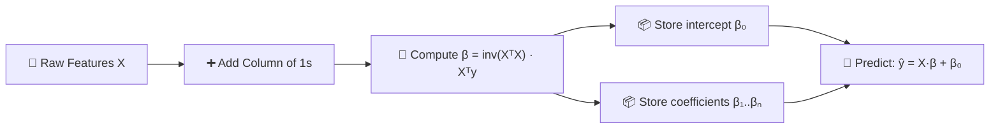

# 📐 Linear Regression — Ordinary Least Squares (OLS)

> A custom implementation of a Linear Regression model using the **closed-form OLS solution**, built from scratch with NumPy.

---

## 1. The Linear Regression Model

In simple (and multiple) linear regression, the model is expressed as:

```
  ŷ  =  β₀  +  β₁x₁  +  β₂x₂  +  ⋯  +  βₙxₙ  +  ε
```

| Symbol | Meaning |
|--------|---------|
| **y** | Dependent variable (target) |
| **x₁, x₂, …, xₙ** | Independent variables (features) |
| **β₀** | Intercept (bias term) |
| **β₁, β₂, …, βₙ** | Coefficients (slopes) for each feature |
| **ε** | Error term (residual noise) |

> [!IMPORTANT]
> The goal is to find values of β₀, β₁, …, βₙ that **minimize** the Mean Squared Error (MSE) between actual and predicted values.

---

## 2. Ordinary Least Squares (OLS)

OLS minimizes the **sum of squared residuals** between observed data points and predicted values. The closed-form solution is:

```
  ┌─────────────────────────────┐
  │                             │
  │   β  =  (XᵀX)⁻¹ · Xᵀy    │
  │                             │
  └─────────────────────────────┘
```

| Component | Description |
|-----------|-------------|
| **X** | Design matrix — input features **plus** a column of ones for the intercept |
| **y** | Target vector |
| **Xᵀ** | Transpose of the design matrix |
| **(XᵀX)⁻¹** | Inverse of the Gram matrix XᵀX |
| **β** | Resulting vector of all coefficients, including the intercept |

> [!NOTE]
> Unlike iterative methods (e.g., Gradient Descent), OLS computes coefficients **directly** in one step. This makes it extremely efficient for smaller datasets but can become computationally expensive when the number of features is very large.

---

## 3. Code Implementation

### 3.1 Class Initialization

```python
class MyLR:
    def __init__(self):
        self.coef_ = None
        self.intercept_ = None
```

- **`coef_`** → Will hold the feature coefficients β₁, β₂, …, βₙ
- **`intercept_`** → Will hold the intercept β₀
- Both are initialized as `None` to indicate the model is **untrained**.

---

### 3.2 Fit Method — Learning the Coefficients

```python
def fit(self, X_train, y_train):
    X_train = np.insert(X_train, 0, 1, axis=1)
    betas = np.linalg.inv(np.dot(X_train.T, X_train)).dot(X_train.T).dot(y_train)
    self.intercept_ = betas[0]
    self.coef_ = betas[1:]
```

#### Step-by-step breakdown:

---

##### ① Insert a Column of Ones

```python
X_train = np.insert(X_train, 0, 1, axis=1)
```

Transforms the feature matrix from its original form into a **design matrix**:

```
                                              ┌                              ┐
  ┌                        ┐                  │  1    x₁₁   x₁₂  ⋯   x₁ₙ  │
  │  x₁₁   x₁₂  ⋯   x₁ₙ │                  │  1    x₂₁   x₂₂  ⋯   x₂ₙ  │
  │  x₂₁   x₂₂  ⋯   x₂ₙ │   ──────▶        │  1    x₃₁   x₃₂  ⋯   x₃ₙ  │
  │   ⋮      ⋮    ⋱    ⋮  │                  │  ⋮     ⋮      ⋮    ⋱    ⋮   │
  │  xₘ₁   xₘ₂  ⋯   xₘₙ │                  │  1    xₘ₁   xₘ₂  ⋯   xₘₙ  │
  └                        ┘                  └                              ┘
        Original X                                   Design Matrix X
```

> [!TIP]
> Adding a column of ones allows the intercept β₀ to be treated as just another coefficient — the coefficient of the constant feature `1`. This unifies the entire computation into a single matrix equation.

---

##### ② Compute the OLS Coefficients

```python
betas = np.linalg.inv(np.dot(X_train.T, X_train)).dot(X_train.T).dot(y_train)
```

This single line implements the full OLS formula **β = (XᵀX)⁻¹Xᵀy** :

| Code Fragment | Math Operation | Description |
|---------------|:--------------:|-------------|
| `np.dot(X_train.T, X_train)` | **XᵀX** | Gram matrix — captures feature correlations |
| `np.linalg.inv(...)` | **(XᵀX)⁻¹** | Inverse of the Gram matrix |
| `.dot(X_train.T)` | **(XᵀX)⁻¹ · Xᵀ** | Intermediate projection matrix |
| `.dot(y_train)` | **(XᵀX)⁻¹ · Xᵀ · y** | Final coefficient vector **β** |

Computation flow:

```
  Xᵀ · X        →     (XᵀX)⁻¹       →    (XᵀX)⁻¹ · Xᵀ     →    (XᵀX)⁻¹ · Xᵀ · y
  ───────             ──────────            ──────────────          ─────────────────
  Gram Matrix      Inverse of Gram      Projection Matrix        Coefficient Vector β
```

> [!WARNING]
> If XᵀX is **singular** (non-invertible) — e.g., due to perfect multicollinearity among features — `np.linalg.inv` will raise a `LinAlgError`. In practice, consider using `np.linalg.pinv` (pseudo-inverse) for numerical stability.

---

##### ③ Separate Intercept and Coefficients

```python
self.intercept_ = betas[0]
self.coef_ = betas[1:]
```

The resulting `betas` vector is split as follows:

```
       ┌      ┐
       │  β₀  │  ◄─── intercept_     (bias term)
       │──────│
       │  β₁  │
       │  β₂  │  ◄─── coef_          (feature coefficients)
       │  ⋮   │
       │  βₙ  │
       └      ┘
```

| Variable | Value | Meaning |
|----------|-------|---------|
| `self.intercept_` | β₀ | The y-intercept / bias |
| `self.coef_` | β₁, β₂, …, βₙ | Slopes for each input feature |

---

### 3.3 Predict Method — Making Predictions

```python
def predict(self, X_test):
    y_pred = np.dot(X_test, self.coef_) + self.intercept_
    return y_pred
```

Applies the learned model to new data:

```
  ŷ  =  X_test · β  +  β₀
```

| Code Fragment | Math Operation | Description |
|---------------|:--------------:|-------------|
| `np.dot(X_test, self.coef_)` | **X_test · β** | Weighted sum of features for each sample |
| `+ self.intercept_` | **+ β₀** | Add the bias / intercept term |

Expanded view for a single prediction:

```
  ŷᵢ  =  β₁·x₁  +  β₂·x₂  +  ⋯  +  βₙ·xₙ  +  β₀
         ──────     ──────          ──────     ────
         feature₁   feature₂       featureₙ   bias
```

> [!NOTE]
> No column of ones is inserted here because the intercept is added **separately** via `+ self.intercept_`.

---

## 4. Complete Code

```python
import numpy as np

class MyLR:
    def __init__(self):
        self.coef_ = None
        self.intercept_ = None

    def fit(self, X_train, y_train):
        X_train = np.insert(X_train, 0, 1, axis=1)
        betas = np.linalg.inv(
            np.dot(X_train.T, X_train)
        ).dot(X_train.T).dot(y_train)
        self.intercept_ = betas[0]
        self.coef_ = betas[1:]

    def predict(self, X_test):
        y_pred = np.dot(X_test, self.coef_) + self.intercept_
        return y_pred
```

---

## 5. Visual Summary



---

## 6. Key Takeaways

| Aspect | Detail |
|--------|--------|
| **Method** | Ordinary Least Squares (Closed-Form) |
| **Training** | Direct matrix computation — **no iterations** |
| **Time Complexity** | O(n²m + n³) where m = samples, n = features |
| **Best For** | Small-to-medium datasets with well-conditioned features |
| **Limitation** | Requires XᵀX to be invertible (no perfect multicollinearity) |

> [!CAUTION]
> For very large feature spaces or ill-conditioned data, prefer regularized methods like **Ridge Regression** (L₂) or **Lasso** (L₁), or use iterative solvers like **Gradient Descent**.
